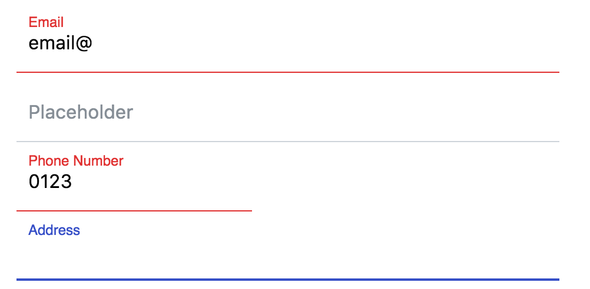

# Material-input



## Installation

```bash
yarn add @antipodes-medical/material-input
```

```javascript
import '@antipodes-medical/material-input';
```

## Utilisation

Il suffit d'insérer l'élément `<material-input>` dans votre élément html `<form>` et le tour est joué. <br />
Un champ `<input>` visuellement caché sera créé qui synchronise ses valeurs avec le `<material-input>` afin de permettre aux formulaires
normaux de reprendre la valeur.

```html

<material-input name="username"></material-input>
```

### Input existant

Si un input est déjà existant, vous pouvez le synchroniser avec l'élément `<material-input>`. Au lieu que l'élément créer un élément
visuellement caché il va prendre celui déjà existant.

```html

<material-input name="username" input-exist></material-input>
<input name="username" />
```

Ici l'élément `<input name="username" />` sera utilisé par l'élément `<material-input>`.

### Labels

Par défaut, les 'material input' utilisent des label flottants qui peuvent être définies via l'attribut `label`. Cela signifie que le label
ressemble à un placeholder, lorsque le champ est centré ou rempli, il est déplacé au-dessus du texte de l'utilisateur.

```html

<material-input name="username" label="Choose your username"></material-input>
```

### Placeholders

Vous pouvez utiliser des placeholder normaux à la place des labels, ou en combinaison avec elles. Si vous choisissez d'utiliser les deux, le
label sera toujours au-dessus du placeholder si vous choisissez d'utiliser les deux.

```html

<material-input name="username" label="username" placeholder="Choose your username"></material-input>
```

### Value

Comme un champ de saisie normal, vous pouvez définir la valeur à l'aide de l'attribut `value` en html ou via javascript, soit en définissant
l'attribut ou en définissant directement la propriété `value`.

```html
<!-- html -->
<material-input name="animal" value="cat"></material-input>
```

```javascript
// javascript
document.querySelector('material-input.animal').value = 'cat';
document.querySelector('material-input.animal').setAttribute('value', 'cat');
```

### Validation

La validation fonctionne comme avec tout élément `<input>` par défaut. Ajoutez un `required` ou définissez le `type` sur `email` et vous
obtiendrez les notifications de validation du navigateur. De plus, l'élément `material-input` aura un style `valid` ou `invalid`.

De plus, il est possible de définir explicitement un champ comme étant `invalide` en utilisant la méthode par défaut `setCustomValidity` sur
l'entrée "matérielle". Vous pouvez en savoir plus sur la
fonctionnalité [setCustomValidity sur MDN](https://developer.mozilla.org/en-US/docs/Web/Guide/HTML/HTML5/Constraint_validation#Controlling_the_text_of_constraints_violation)
.

```javascript
document.querySelector('material-input.customValidatedItem').setCustomValidity('This is not valid.');
```

#### Backend validation

Si vous validez vos formulaires via votre backend (ce que vous devriez faire !), vous pouvez ajouter un attribut `invalid` ou `valid`
au `material-input`. Cela mettra le champ dans l'état défini.

#### Error messages

Vous pouvez définir l'attribut `message`, qui ajoutera un message d'erreur sous le champ. Il s'agit toujours d'un message d'erreur, quel que
soit l'état dans lequel se trouve le champ.

#### Autovalidate

Lorsque vous ajoutez l'attribut `autovalidate` à l'entrée `material-input`, le champ sera validé à chaque événement `keydown`. Cependant,
cela signifie qu'un champ sans règles de validation sera toujours valide et recevra immédiatement l'attribut `valid`.

## Custom styling

```css
/* select your specific input or all */
material-input.some-class {
    /* the font family of the input */
    --material-input-font-family: inherit;

    /* the text color of the input */
    --material-input-text-color: black;
    
    /* the padding of the input */
    --material-input-text-padding: 1.4em 1em .6em 10px;

    /* the text color of the placeholder or the floating label on an empty field */
    --material-input-placeholder-color: grey;

    /* the color of the border and label when the field is focused */
    --material-input-highlight-color: indigo;

    /* the color of the border and label when the field is in an invalid state */
    --material-input-invalid-color: red;

    /* the color of the border and label when the field is in a valid state */
    --material-input-valid-color: green;

    /* the default color of the bottom border */
    --material-input-border-color: orange;

    /* the height of the bottom border when the field is not focused */
    --material-input-line-height: 1px;

    /* the height of the bottom border when the field is focused */
    --material-input-highlight-line-height: 3px;
    
    /* The placeholder left */
    --material-input-placeholder-left: 10px;
    
    /* The placeholder top */
    --material-input-placeholder-top: 1.42em;
}
```
